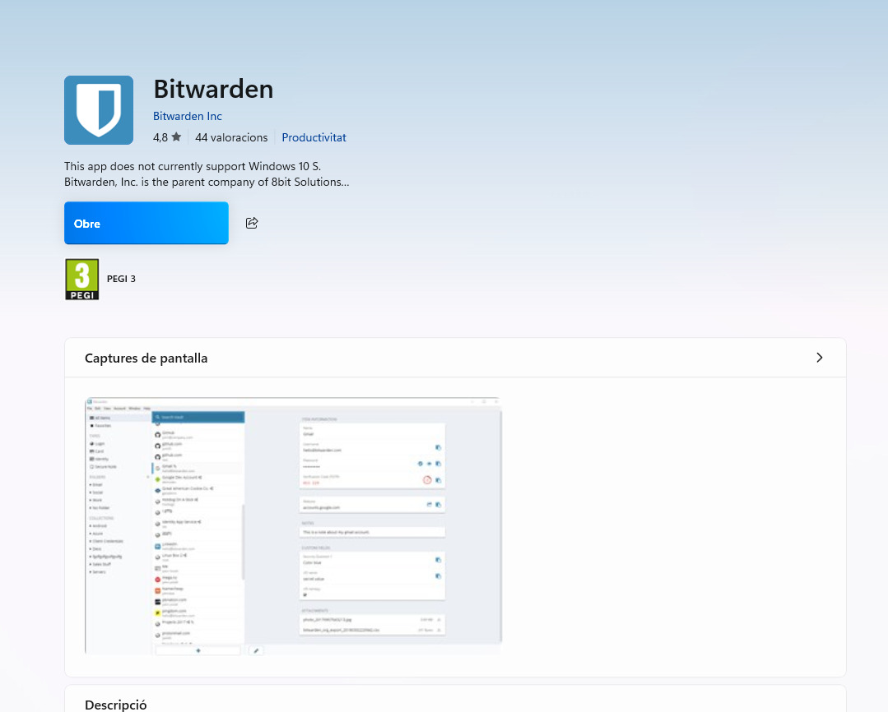

# **GUIA**

Utilitzant l'eina que heu seleccionat a la Fase 1 (Bitwarden, KeePassX, o similar), heu de crear una Guia d'Ús per a l'Equip Tècnic. Aquesta guia ha de ser clara i basada en captures de pantalla i instruccions pas a pas.

La guia ha de cobrir els següents punts obligatoris:

1\. Instal·lació i Configuració Inicial: Descàrrega, instal·lació i creació de la BBDD  
principal o compte mestre.

2\. Generació de Contrasenyes Segures: Explicació de com utilitzar el generador de  
contrasenyes de l'eina (paràmetres, longitud, caràcters especials).

3\. Exemples d'Ús i Emplenament Automàtic:  
● Com desar una credencial d'un compte de correu electrònic.  
● Com desar una credencial d'una aplicació o servei web.  
● Com fer servir l’extensió del navegador per emplenar automàticament les dades.

4\. Gestió de Còpies de Seguretat (Backup):  
● Explicació detallada de com fer una còpia de seguretat de l'arxiu de contrasenyes  
(KDBX en KeePass o Exportació en Bitwarden).  
● Recomanació de la millor pràctica per emmagatzemar aquesta còpia de seguretat de forma segura (clau USB xifrada o emmagatzematge xifrat al núvol).

Primer instalem Bitwarden i l'obrim

Una vegada a dins crearem el nostre nou compte.  

Primerament posem el nostre nom i correu.

Fem la comprovació per poder continuar amb la creació del nou compte.

Posem una contrasenya difícil, com podria ser aquesta:

Tenim l'opció de posar l'extensió, que sempre va bé per poder emplenar automàticament les contrasenyes de manera segura amb un sol clic (no ho hem pogut fer, per l'accés restringit, aleshores passem aquesta part).

Ara ja tindríem el nostre compte nou creat i estaríem dins.

**PART 2**

**2.Generació de Contrasenyes Segures: Explicació de com utilitzar el generador de contrasenyes de l'eina (paràmetres, longitud, caràcters especials).**

Obrim el bitwarden i adalt a l’esquerra li donem a mostra 

Ara li donem a generador 

Configureu els paràmetres segons les necessitats de seguretat:

* **Longitud:** mínim 16 caràcters (recomanat 20 o més).

* **Lletres majúscules i minúscules:** activades.

* **Números:** activats.

* **Caràcters especials:** activats.

PART 3

Obrim el bitwarden per la web i posem caixes fortes 

Despres a nou i seguidament a inici de sessio 

I seguidament s'obre això i posem les nostres dades,el nom d’usuari,la contrasenya i la clau autenticadora. 

Entrem desde una compte de gmail de casa i instalem una extensio de bitwarden,i despres busquem github i iniciem sessió.

Ara busquem gmail i com veiem ja surt inici de sessió de nou

I després de donarli a inici de sessió s’obra aixo i posem el correu i la contrasenya i ja estaria

PART4

Obriu Bitwarden i inicieu sessió amb el vostre compte.  
Aneu a **Configuració (Settings)** i seleccioneu **Export Vault**.  
Trieu el format de sortida (per defecte .json o .csv).

Posem la contrasenya

I aqui ja ho tenim descarregat

